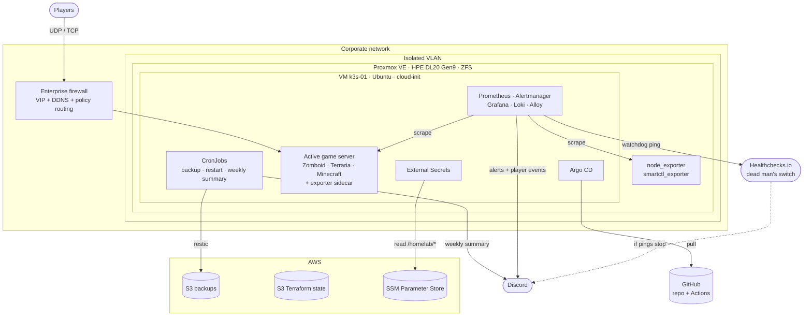

# proxmox-k3s-platform

A single-node, production-style platform on a recycled **HPE ProLiant DL20 Gen9**, managed entirely as code.

**Proxmox VE** is provisioned with **Terraform** and **cloud-init**, configured with **Ansible**, and runs **K3s** with **GitOps (Argo CD)**, full **observability** (Prometheus, Grafana, Loki, Alertmanager), **secrets from AWS SSM** via External Secrets, and **encrypted off-site backups on AWS S3**.

The workload is a small **game-server platform** for a group of friends: **Project Zomboid (Build 42)**, **Terraria** and **modded Minecraft**, one active at a time and switched through Git. The games are the excuse; the platform around them is the point. It is operated like a real service: SLO, alerting with a first-step action in every message, an external dead man's switch, tested restores, and a CI that checks its own tools.

<!-- DASHBOARD_IMAGE -->

---

## Highlights

- **Everything as code.** VM, OS config, cluster, workloads, dashboards, alert rules and AWS resources live in this repository.
- **GitOps.** Argo CD (app of apps) reconciles the cluster from `main`: self-heal for configuration, manual sync for the stateful game servers.
- **A platform, not a one-off.** Each game is a catalog entry; a generator renders its Service, metrics, backup and Argo CD Application, and switching the active game is a commit made by one command.
- **Custom exporters** (stdlib Python) behind one metric contract: server health, players online and all-time playtime over RCON or REST, plus character deaths parsed from server logs.
- **Player-facing notifications** on Discord: who joined (and who else is online), character deaths, playtime milestones and a weekly summary.
- **Alerting designed to be trusted:** severities mapped to response time, a first-step action in every message, a mute window for the daily restart, inhibition of cascading alerts, and an external dead man's switch.
- **Secrets never in Git:** Bitwarden (humans) → AWS SSM (machines) → External Secrets (cluster), with self-healing Secrets.
- **Backups you can restore:** daily encrypted restic snapshots to S3, restore tested.
- **Reproducible CI:** tool versions pinned and checksum-verified, actions pinned by commit SHA, pinned runner image; Dependabot; a local runner that mirrors CI and verifies the tools themselves.
- **Near-zero cost:** S3 and SSM usage is measured in cents per month.

---

## Architecture

---

## Stack

| Layer | Tools |
|---|---|
| Hardware | HPE ProLiant DL20 Gen9, Xeon E3-1220 v5, 24 GB ECC, 2x HDD (ZFS) |
| Virtualization | Proxmox VE |
| Provisioning | Terraform (`bpg/proxmox`, `hashicorp/aws`), cloud-init, remote state on S3 |
| Configuration | Ansible (roles: `k3s`, `gameserver_net`, `host_exporters`) |
| Orchestration | K3s (pinned version, secrets encrypted at rest) |
| GitOps | Argo CD (app of apps) |
| Workloads | Project Zomboid (Build 42), Terraria (TShock), Minecraft (Fabric modpack) |
| Observability | kube-prometheus-stack, Loki, Grafana Alloy, custom Python exporters |
| Alerting | Alertmanager → Discord, Healthchecks.io dead man's switch |
| Secrets | Bitwarden, AWS SSM Parameter Store, External Secrets Operator |
| Backup | restic → S3 (encrypted, deduplicated) |
| CI | GitHub Actions: tflint, ansible-lint, kubeconform, promtool, shellcheck, Trivy; Dependabot |

---

## Repository layout
terraform/ Proxmox VM (cloud image, cloud-init, DHCP-reserved NIC)
terraform-aws/ S3 (backups + state), least-privilege IAM, SSM parameters, Budgets
ansible/ K3s install, game-server network tuning, host exporters
k8s/argocd/ Argo CD install + app of apps
k8s/zomboid/ Project Zomboid: server, exporter source, backup/restart/summary CronJobs
k8s/games/ One directory per catalog game (Terraria, Minecraft): game.yaml, StatefulSet, generated manifests
platform/ Active game and platform defaults read by the generator
k8s/monitoring/ Helm values, alert rules, generated Grafana dashboard
k8s/external-secrets/ External Secrets Operator + ClusterSecretStore (AWS SSM)
scripts/ Game manifest generator, game switch, dashboard generator, local CI runner, secret publishing, image pinning
docs/ Architecture decision records, client installer for the Minecraft modpack

---

## How it comes together

1. **`terraform-aws/`** creates the state bucket, the backup bucket, scoped IAM users, SSM parameters and a budget alarm.
2. **`terraform/`** creates the VM from an Ubuntu cloud image with cloud-init (user, SSH key, network).
3. **Ansible** installs K3s (artifacts fetched and checksum-verified on the control node), tunes the game network path, and installs exporters on the Proxmox host.
4. **Helm** installs the observability stack, External Secrets and Argo CD, all with pinned chart versions.
5. **Two bootstrap secrets** (the External Secrets AWS credential and the Argo CD deploy key) and one `kubectl apply` of the root app. Argo CD reconciles everything else, and External Secrets restores every Secret from SSM.

Day-to-day tasks are wrapped in a `Makefile`: run `make help` to list them (`make ci` mirrors the GitHub Actions checks locally).

---

## Game platform

Three games share one platform and only one runs at a time: the VM fits a single heavy game, and the group never plays two at once.

| Game | Server | Player data from | Notes |
|---|---|---|---|
| Project Zomboid (Build 42) | SteamCMD init + custom entrypoint | RCON, server logs | Daily restart with in-game warnings |
| Terraria | TShock, image pinned by digest | TShock REST API | Non-root, characters stored on the server |
| Minecraft | Fabric modpack pinned by version ID | RCON | Whitelist plus in-game password authentication |

- **Catalog-driven.** Each game declares its name, ports, backup paths and schedule in `k8s/games/<game>/game.yaml`. `scripts/render-games.py` generates the game Service, the metrics Service and ServiceMonitor, the restic backup (ExternalSecret + CronJob) and the Argo CD Application. Only the StatefulSet and the game's own Secrets are hand-written, because that is where games really differ. The dashboard generator, the switch script, the status command and CI read the same catalog (`scripts/catalog.py`), so no script keeps its own list of games. CI fails if a generated file is stale or the catalog is inconsistent.
- **Switching is a commit.** `make switch-game GAME=terraria` refuses to run while anyone is online, saves the world, flips the replica patches and `platform/active-game.yaml`, commits, syncs the outgoing game first and the incoming one second, and announces on Discord when the new server is ready. Git always says what is running.
- **One metric contract.** The exporter sidecar of each catalog game exposes `game_up`, `game_players_online`, `game_player_online{player}` and `game_player_playtime_seconds_total{player}`, whatever the protocol behind it, so a new game reuses the same dashboard panels, alerts and Discord notifications.
- **Alerts follow the desired state.** `GameDown` compares `kube_statefulset_replicas` with ready replicas, so a stopped game never pages. It is generated from the catalog together with `GameRestarted` and `GameMemoryHigh`, so every new game gets the same alert set without anyone editing a rule.
- **Players get a one-file installer.** For the modded Minecraft server, `docs/minecraft/install-cobbleverse.ps1` installs the exact modpack version the server runs, downloading every mod from the official CDN and verifying its SHA-512.
- **Decisions are written down** in `docs/adr/`: why not Agones or a game panel, why Git owns the active game, and why a generator replaced Kustomize components.

Project Zomboid, the first game, still runs on its original hand-written manifests and `zomboid_*` metrics; moving it to the catalog is on the roadmap.

### Project Zomboid, built for operability

- **StatefulSet** with an init container that installs or updates the server via SteamCMD and writes the server config from ConfigMap + Secrets.
- **Entrypoint built for operability:** server commands go through a console FIFO held open by the shell, so `save`, `quit` and in-game announcements can be sent from `kubectl exec`, CronJobs and the `preStop` hook. When the game process dies, the container exits and Kubernetes restarts it, instead of leaving a "Running" pod with no game.
- **Daily restart** at 06:00 with in-game warnings, and a graceful `save` before every shutdown.
- **Launcher arguments are filtered from logs** at the source and again in the log pipeline, so credentials never reach Loki.

---

## Player notifications

| Event | Discord message |
|---|---|
| Join | 🟢 *iago joined* · 3/6 online: iago, joao, maria (mentions an opt-in `@Zomboid` role) |
| Leave | 🔴 *iago left* · session of 2h26m |
| Character death | 💀 *iago died* · survived 34 in-game hours |
| Playtime milestone | 🏆 *joao reached 50 hours on the server* |
| Weekly summary | 📊 Hours played, ranking with medals, peak concurrency, deaths, availability |

<!-- DISCORD_IMAGE -->

Joins, leaves and the weekly summary work for every game; deaths and playtime milestones are Project Zomboid only for now.

**How it works:** the exporter sidecar polls the server over RCON every 15 seconds, keeps all-time playtime per player on the game volume (seeded from Prometheus history on first start), and tails the server's PerkLog for deaths. Prometheus rules turn those metrics into events; Alertmanager routes them to Discord with their own templates, separate from operational alerts. A CronJob builds the weekly summary from PromQL queries. No extra services were added for any of this.

---

## Observability

The **AsunBoid** dashboard covers every game on the platform and reads top to bottom, from "is it up?" to "why?":

- **Now:** server status, players online, 7-day availability (SLO), uptime, last backup, active alerts, and an availability strip showing every outage in the period.
- **Players:** who is online now, players over time, a per-player session timeline, and a table with playtime (24h, 7d, 30d, all time), deaths and last seen.
- **Game server resources:** memory against the container limit, CPU against the VM's vCPUs, unexpected restarts.
- **Host hardware** (collapsed): SMART, ZFS pool, ECC errors, disk temperature, free space, host RAM.
- **Logs and alerts** (collapsed): connection logs, warnings and errors, firing alerts.

The dashboard JSON is **generated** by `scripts/build-dashboard.py`, so it is reviewable in a pull request; CI fails if the committed YAML drifts from the generator.

---

## Alerting

| Severity | Meaning | Repeat |
|---|---|---|
| `critical` | Act now (server down, disk failing, no backup in 26h) | every 2h |
| `warning` | Act today (memory pressure, unexpected restart, reallocated sectors, OOMKilled container) | every 12h |
| `info` | Record only, never notifies (player events have their own route) | n/a |

- **Every message carries a first-step action**, the command to run at 3 a.m.
- **Mute window** for availability alerts during the daily restart, so the channel never cries wolf.
- **Inhibitions:** with the host down, disk/ZFS/ECC alerts stay silent; with the pod gone, restart and memory alerts stay silent.
- **Dead man's switch:** Alertmanager's always-firing `Watchdog` pings Healthchecks.io every minute. If the whole VM or host goes down, the external service notices the silence and alerts Discord.

---

## Backup and disaster recovery

| Layer | Frequency | Protects against |
|---|---|---|
| In-game autosave | Every 10 minutes | Server crash |
| Built-in game backups | On start and on version change | Corrupted save, bad update |
| restic → S3 | Daily, 7 daily + 4 weekly | Disk, VM or host loss |

A restore of the latest snapshot completes in about **2 seconds** for the current world size. A full rebuild drill (VM from Terraform, cluster from Ansible, workloads from Argo CD, Secrets from SSM, world from S3) is on the roadmap; the measured RTO will be published here.

---

## Security

- IAM users scoped to a single bucket (backup) and a single SSM path, read-only (secrets)
- Terraform state bucket: versioned, encrypted, public access blocked, TLS-only, `prevent_destroy`, native S3 locking
- Kubernetes Secrets encrypted at rest and delivered by External Secrets; nothing secret in Git
- Container images pinned by digest; chart, tool and action versions pinned
- Game server and sidecars run as non-root; RCON reachable only inside the pod
- CI fails on any committed secret (Trivy); environment-specific values live in git-ignored local files
- The game VM sits in an isolated VLAN with no route to the internal network

---

## CI

Every push runs Terraform `fmt`/`validate`/`tflint` for both stacks, `ansible-lint`, `kubeconform` (including CRDs), drift checks for the generated dashboard and game manifests, alert rule tests, `shellcheck`, Python syntax and a Trivy secret scan.

- **Reproducible:** the runner image and the versions of Terraform, tflint, kubeconform, Trivy, promtool and ansible-lint are pinned; downloaded binaries are verified by SHA-256 (`scripts/install-ci-tools.sh`, shared by CI and the local runner) and GitHub Actions are pinned by commit SHA. Dependabot proposes upgrades weekly, and they merge only on a green build.
- **Alert rules are tested like code:** `promtool` validates every rule and runs unit tests with synthetic series (`k8s/monitoring/tests/`): a stopped game must not page, a missing backup must, and each alert must fire with the expected labels and text. A lint also fails the build if a `critical` or `warning` alert has no first-step action.
- **Same checks locally:** `scripts/ci-local.sh` runs the identical checks on a clean copy of the tracked files (so local secrets cannot leak into the scan) and refuses to run if any tool fails a version smoke test.

---

## Engineering notes

Real problems hit while building and operating this, and how they were solved.

**UEFI boot loop on the HPE B140i.** The OS installed fine but the server always fell through to PXE. The embedded "Dynamic Smart Array" exposes only its own logical drives to UEFI. Switching the controller to AHCI and letting ZFS manage the disks fixed it.

**DHCP reservation ignored.** `systemd-networkd` identifies itself with a DUID by default, while the DHCP server matches reservations by MAC. Setting `dhcp-identifier: mac` in the cloud-init network config fixed it.

**Restricted egress.** The VM could reach GitHub's API but not its release CDN. The Ansible role downloads K3s artifacts on the control node, verifies their checksums and pushes them to the VM.

**CGNAT and asymmetric routing.** Inbound traffic arrived through one ISP while replies left through another behind CGNAT. A policy route keeps the game ports symmetric.

**"Loading the world" never finished.** Packet captures showed large UDP packets retransmitted forever: fragments were dropped on the path. The game's RakNet transport negotiates MTU at connect time, so an `iptables` length match drops oversized handshake probes and forces a smaller MTU. Codified in the `gameserver_net` role.

**A "harmless" hardening took the server down for an hour.** Removing the default admin account looked like a security win, but the server requires it at startup and, when missing, blocks on an interactive prompt with no TTY. The pod stayed `Running` with no game. The alert fired; the fix was to always pass the admin password at boot (from SSM), filter launcher arguments from logs, and restructure the entrypoint so the container exits when the game does.

**Health probes filled the server.** Terraria counts every TCP connection as a player slot, so Kubernetes TCP probes slowly exhausted the slots until nobody could join. The probes now read `/proc/net/tcp` for a listening socket instead of opening a connection.

**A stopped game kept Argo CD "Progressing".** A LoadBalancer Service with no ready endpoints never gets an address from K3s ServiceLB, and Argo CD waits for one forever. A custom health check treats game Services of stopped games as healthy, and an alert covers the real failure mode: a ServiceLB pod stuck pending because of a port conflict.

**Grafana was OOMKilled 15 times in a day, silently.** A heavier dashboard made it obvious: the memory limit had been too tight from the start, and no alert covered monitoring components. The limit was raised based on measured usage, and a cluster-wide `ContainerOOMKilled` alert now covers every workload.

**A linter that passed without running.** A WSL crash during installation left the local `ansible-lint` as an empty file: it exited 0 and printed nothing, so local checks passed while CI failed. CI also drifted because it installed the latest linter on every run. Fixes: pin every tool version, and make the local runner smoke-test each tool before trusting its result.

**Empty secrets.** A password-manager CLI returned nothing for a missing item, creating empty Secrets. Fail-fast guards came first; External Secrets with SSM as the source of truth removed the manual step entirely.

---

## Cost

| Item | Monthly |
|---|---|
| S3 (backups + state) | cents |
| SSM Parameter Store (standard), KMS (AWS managed key) | free |
| Healthchecks.io, GitHub Actions, Dependabot | free tier |
| Hardware | recycled |

A Budgets alarm fires above USD 1/month, and a CloudWatch alarm watches the size of the backup bucket, which is what drives the bill.

---

## Roadmap

- [ ] Timed full DR drill and published RTO
- [ ] Migrate Project Zomboid to the catalog and the `game_*` metric contract
- [ ] Manage the Helm releases (monitoring, External Secrets, Argo CD) through Argo CD
- [ ] Renovate for image digests and chart versions
- [ ] Migrate to the non-deprecated `proxmox_download_file` resource
- [ ] Custom game-server image built in CI
- [ ] GitHub Actions to AWS via OIDC (no long-lived keys)

---

## Author

**Iago Rosa Pinheiro** · Technical Support Engineer moving into DevOps / SRE / Platform Engineering
[LinkedIn](https://linkedin.com/in/iagorp6) · [GitHub](https://github.com/iagorp6)
